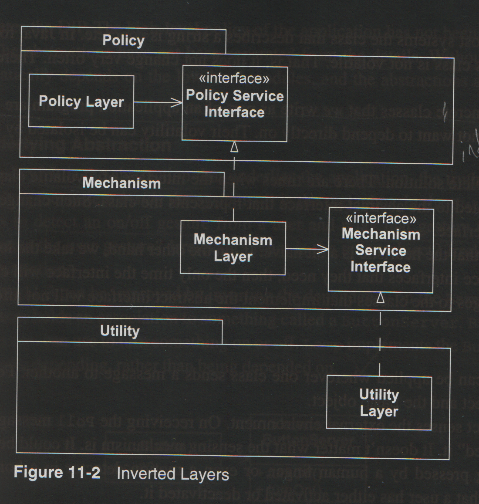
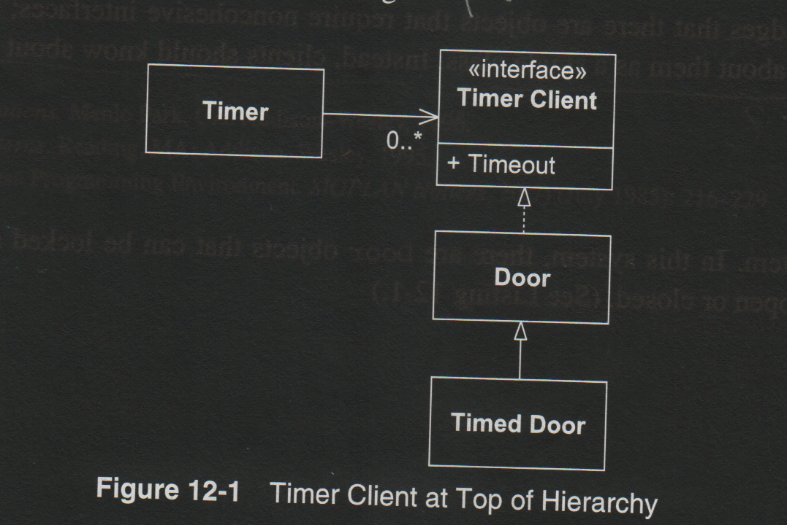
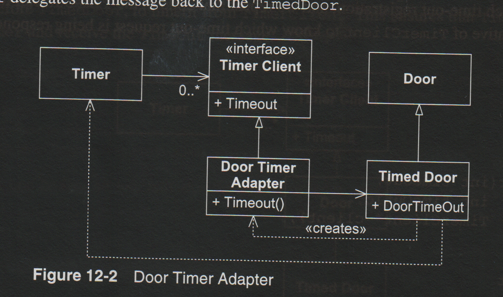
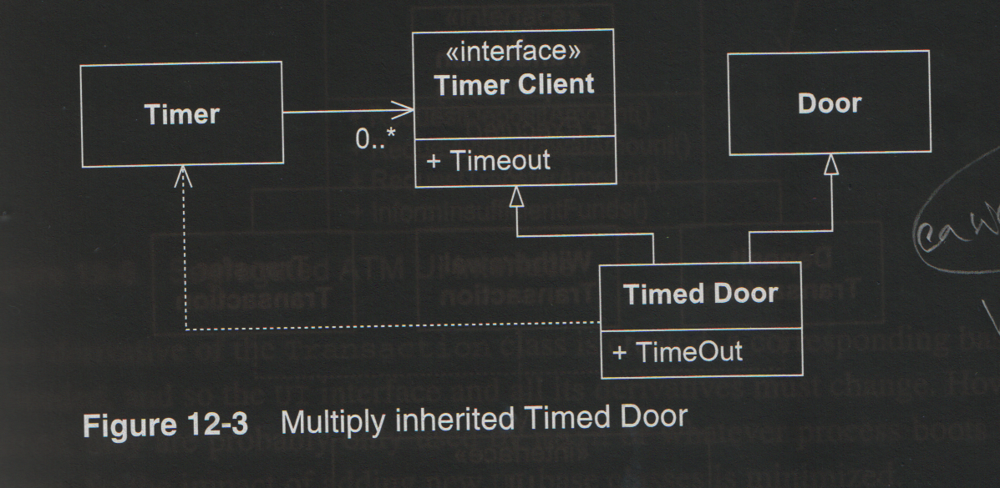
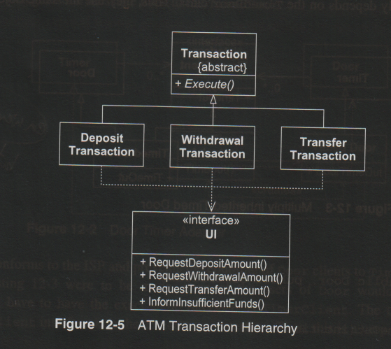
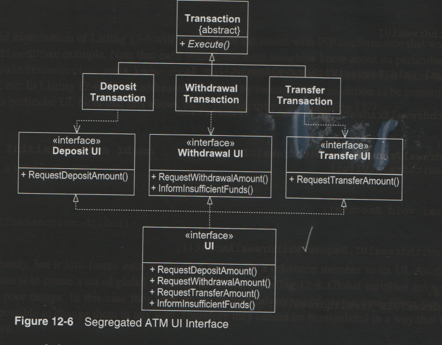

## Purpose:

This book is a more practical and fleshed-out suppliment to Clean Architecture, despite being 20 years its senior. In particular, OOP Design Prinicples and more specific development practices are developed.

This book is from 2003 - so some of the ideas are out of date.

In particular, the author (in 2003) was deeply tied to Agile Development and Paired+Extreme Programming. 

He goes on a lot about software constantly changing (the fear of the code-blob or code rewrite), so the methedology is developed to directly engage with this  

I get the impression that although this helps with bad development outcomes, known and unknown unknowns can still occur. Responding to change too much also can mean one is responding to noise, instead of signal. 

In particular high customer engagement is required for this kind of development...this assumes the customer is not an idiot, or inconsistent. Some development teams may not even have a choice (cannot always avoid a bad customer - Quarterly results becon...)

As of 2022, some of these ideas remain viable. It appears that the Scrum+Github won the methedology wars, in the end.

Likewise, I pick and choose what I thikn is relevent - relative to how history has played out on this foul year of our Lord (2022).

# Section I: Agile Development:

## Agile Practices:

- So the most important factor is people being able to work together effectively.

- Consider a software project to be a kind of balance:

$$ \{Fear,Constraints,Rigidity\} \rightarrow \{SweetSpot\} \leftarrow \{Risk,Flexibility,NoRules \}  $$

- Developers can easily fail being on one side too much. This leads to Ruin (a project that needs rebuilt, or does not work).

### Agile Manifesto:

1) Individuals and Interactions over Tools and Process.
    - Face-to-face interation is the most effective way to align requirements.
    - The best teams self-organize, they are not forced by management.

2) Working Software over Documentation.
    - Nobody cares about what the project should have done, or what you expect it to do.
    - Tests **are** documentation.

3) Regular Customer Collaboration over Contracts.
    - Team regularly talks to client, produces features quickly, has regular milestones for presentation.

4) Responses to Changes over Big Plans.
    - A meta period where team reflects on past performance, and how to do better.
    - You get the most critical things done first (Just In Time). You don't place code skeletons for later (wishful thinking).

## Overview of Extreme Programming:

I have never done this form of programming - probably a hybrid or parts of it are used in development groups these days. Summary below:

1) Customers are Team Members.
    - A Customer is anyone that dictates requiements for the project, not necessarily the person that pays.
    - Their given requiements are called "stories".

2) User Stories:
    - Requirements change, so developers write a few words to represent a requirement, and discuss it with the customer to distill it down to its essense. 

3) Short Development Cycles:
    - Iteration Plan: Customer selects the most important stories, and over a period of two weeks developers try to implement them in the product.

    - A longer term plan called a Release Plan (upto 6 iterations) is also created, to give a more focused goal.

    - Customer can re-prioritize or change stories at any time, nothing is set in stone.

4) Acceptance Tests:
    - When a story is written, acceptance tests are written soon after. These are to confirm that the feature has been implemented correctly.

    - These are tests run and *designed by the customer, not the dev team.*

    - Once an AT has been passed, it is **never allowed to fail again**. If a new release is made, and some tests fail, the team cannot move forward until all tests pass again.

5) Pair Programming:
    - Two people code together. One writes and drives, the other observers and gives advice. They clarify ideas and are both engaged. 
    - Teams work in close proximity to other paired programmers. Teams can collaborate.

6) Test Driven Development (TDD):
    - It is hard to prove that a piece of code is correct on all inputs, but easy to show that it doesn't work (a falsifying test).
    - Test are written before the code. Often, code stubs are written just to pass the tests, and then proper code bodies are fleshed out later.

7) Collective Ownership:
    - Anyone can work on any module.
    - Cross-training (even for specialists), is encouraged. This is how they become more mindful of the overall system.

8) Continuous Integration:
    - Code is submitted several times a day, not in a weekly sprint.
        - If N programmers have their own incompatable ideas, a short code session is easier to correct than a week long one.
    - This avoids long merge sessions, and those merging collaborate directly to fix issues on the spot.
    - **The entire system is built everytime. Not just sub-components.**

9) Sustainable Pace:
    - No overtime permitted (except at the very end).
    - Longer hours implies team dysfunction.

10) Simple Design:
    - Team aims for a kind of MVP, and gets the most essential stories implemented first. 
    - Long-winded development sprints for infrastructure, or features in the future are avoided (requirements can easily change anyways).

    - Mantras:
        (i) *Consider the simplest thing that will work* (example: why setup mySQL or Mongo, when a simple JSON input will work?)
        (ii) *You aren't going to need it:* Don't setup infrastructure or advanced tools until they are actually required.
        (iii) *Once and Only Once:* Avoid all code duplication. Correct it immediately when seen.

## Planning:

Below is more details about how planning actually works:

- Splitting Stories:
    - Stories can be too small or too big. They need to be split into correct sized chunks.
    - **Example:** A customer needs to log in, log out, transfer money, pay CC, or deposit money. Each listed requirement would become its own story.

- Story Velocity: 
    - With stories broken up into the same sized chunks (distance), a story can be multipled by velocity to get the estimted time of completion.
    -  For a new team, one code release may be needed to get a first estimate for velocity.

- Release Planning:
    - In addition to customer importance, a customer can sort stories based on estimated time of completion.
    - **Time and importance** allow for a customer to make business decisions.

- Iteration Size: 
    - The length of development before the next release. Typically two weeks.

- Task Planning: 
    - The team sits down and assigns stories to each pair. 
    - A task is something that can be implemented in 0.5 to 4 days.
    - Developers voulenteer for tasks, relative to their down development budgets.

- Half-Way Point:
    - A checkpoint, where half of the stories must be done. If this is not the case, pairs and resources are re-alloted to pick up the slack.

- End of Iteration:
    - After two weeks, the current release is showcased to the customer. The cycle starts again!

## Testing:

Agile Development demands Test Driven Development (TDD). We don't write a feature and test afterwards. **We write our tests first.**

Writing tests first forces the programmer to think about how others will use the function, and catch corner cases in development.

- Unit Test: A test used to ensure a sub-component of the application is working. These tests are "white-box" because the tests know the underlying structure of the component being tested.

- Acceptance Test: A usage test by the customer, that models how they might use the application. These tests are "black-box" - as the customer does not understand the structure of code, and will not make any helpful assumptions.

It is often a good idea to write a meta-test suite for the customer, so they can make their own acceptance tests of the application.

## Refactoring:

To refactor code is to restructure/rewrite it without affecting the overall behaviour in any way. Really, this means "clean code".

Refactoring should be done regularly - to avoid technical debt and anti-patterns later on!

## A Programming Episode:

This gives a chapter long example of all of the techniques mentioned above. 

Lots of things in life involve actual details being hidden behind the scenes - this chapter gives a rare look into how it all fits together (R.Martin has my respect for including this Chapter, alone). 

# Section II: Agile Design:

## What is Agile Design?

- **Design Smells: Symptoms of Poor Design:**
    1) Rigidity: The design is hard to change.
    2) Fragility: The design is easy to break. 
    3) Immobility: The design is hard to reuse.
    4) Viscosity: It is easier to use a hack or do the wrong thing, instead of the right thing.
    5) Needless Complexity: Overdesigned, not parsimonious.
    6) Needless Repetition: Lots of code copying and redundancy.
    7) Opacity: Its not clear what the code does, or unclean code.

These symptoms are related to the idea of **code smells** (any charcteristic in code that signals deeper problems). This often occur when one of the five design rules (listed below) have been violated.

To further our analogy, lots of code smell usually predates **code rot**, code that degrades, becomes more unwieldy, ugly and disorganized.

When the software team spends more time merging and patching holes - and development time starts to get cut -  the code base has become **rotten**.

## SRP: Single Responsibility Principle:

***A class should only have one reason to change.***

- **What is a Responsibility?** In this context, it is a reason for change. If a class can change for X,Y,Z reasons, then it has those as responsibilities.
- Frequently, a class can be changed, due to usage by different **actors** - people or other software that uses the class.
- Responsiblities can also be major functionality that a class handles - such as an ENCODE(), SEND(), RECEIVE() function.
- Corollary: We only count an axis of change if it will change - wishful thinking is ignored.

**Practical Example:**
- Suppose we have a payroll component, that calculates wages, taxes, generates a paystub, alters database records, and has different formulae for divisions in a company (HR, Sales, Service, etc). Many different types of responsibilities are listed here (axes of change, actors, functionality). Each actor and function listed above would be separated into different class objects, to adhere to the SRP.

- Finding responsibilies, and making them granular enough is a skill, not a formulaic exercise. TDD can help find the boundaries of the right responsibilities.

## OCP: The Open-Closed Prinipcle:

***All software entities (class, module, functions...) should be open for extension, but closed for modification.***

A common problem with module modification, is that changing its structure/signatures can lead to cascading changes throughout other modules that depend on it. 

What if we could keep the call signatures the same, but change the module? Practically, OOP inheritence and sub-classes can help with such a thing. Base classes are made abstract, and we make abstract/concrete subclasses to extend them in different contexts.

We can also apply the DIP interface rule, to remove the dependency.

**Wisdom:** Not getting too invested in OCP: There is no perfect design that is open to extension in all contexts - over-planning cannot save one from modifying code. 

The only thing one can do, is to expose oneself to many axes of change at the beginning, to get an overall sense for a robust design.

## LSP: Liskov Substitution Prinicple:

***Subtypes should be substitutable for their base types***

A common (informal) belief about subtypes, is that they exhibit an IS-A relationship (e.g a square IS A kind of rectangle). This is conceptually true, but runs into serious problems when coding.

A subtype of a base type must be substitutable in all code usages, and instances, without causing errors, or relying on control flow hacks to stop run time errors. 

The validity of a model can only be expressed in terms of its clients (how they use the model). You might derive a sub-type, and it passes all your tests, but user XYZ has code that breaks your subtype when it is used in another module.

Design By Contract:
    - The design of a subtype can be rendered invalid, by arbitrary users with their own expectaions of behaviour.
    - To avoid overplanning, one can specify pre and post conditions for methods of a module, so that users restrict how they will utilize the class.
    - *A routine redecleration in a derivative may only replace the original precondition by one equal or weaker, and post condition by one equal or stronger.*
        - Users of the derived class should expect it to accept everything the base class would have, in addition to the derived class (weaker)
        - Users of the derived class should expect side-effects that are the same as the base class, or more specific to the derived class - the outputs should not be confused.
    - The reason why Martin's Square-Circle Dilemma fails is because the post-condition of setWith() in Square is weaker than in Rectangle.

**Using Factoring to solve Subclass Issues:**
- Given a class A, and a proposed sub-class B, we sometimes run into issues where we cannot produce a solution that does not run into subtle errors.
- We can attempt to factor (create a common super-class) between A and B. This class will often be abstract in nature.
- We group methods that have the same responsibilities into the superclass, and keep the differences in the sub-classes A and B, in this case.

In closing, LSP helps with OCP by allowing subclasses to be fully substitutable - this allows us to extend our base classes without changing them in any way.

## DIP: Dependency Inversion Principle:

***a) Abstrations should not depend on details.***

***b) High-level modules should not depend on low-level modules, and both should depend on abstractions.***

Define a High-Level (HL) module as one that contains business rules and policy details for an application. Define a Low-Level (LL) module as one that contains implementation details to enact the policies.

*"Dependency Inversion" (DI)* references the tendency of structural programming techniques to have dependencies in the direction of imports - HL modules import detail oriented LL modules, which creates a HL $\rightarrow$ LL dependency. Good design keeps such abstract, high level policies independent from arbitrary detail.

**Layering:**
    - Complex applications should have layered architectures. DI can be achieved using the interface trick in the formerly dependent module:

**Dependency Inversion in Practice:**
    - why does the Interface trick work, to remove policy dependencies on details?
    - When a policy class imports a detail class, it may have to change if a new version of the detail class is released (new methods, signatures, behaviour, etc).
    - If we are dependent on an Interface, we can substitute any class that implements the interface, in a typed Interface pointer. This makes our policy class methods polymorphic. We can swap out any concrete class for any other, as long as the classes can be referenced by the Interface pointer.
    - Note: if our policy class only uses the Interface pointer, it doesn't matter how our detail class changes anymore!

**Dependency Inversion Examples:**

Consider a coupled policy/detail module (in C)

    //Import these devices...
    #define THERMOMETER
    #define FURNACE
    #define ENGAGE
    #define DISENGAGE

    void Regulate(double minTemp, double maxTemp) {
        for (;;) {
            while (in(THERMOMETER) > minTemp)
                wait(1);
            out(FURNACE.ENGAGE);

            while (in(THERMOMETER) < maxTemp)
                wait(1);
            out(FURNACE.DISENGAGE);
        }
    }

**Now consider a Polymorphic Implementation:**

    void Regulate(Thermometer& t, Heater& h, ...) {
        for(;;) {
            while (t.Read() > minTemp)
                wait(1);
            h.Engage();

            while (t.Read() < maxTemp) 
                wait(1);
            h.Disengage();
        }
    }

We can change our Thermometer or Heater code as much as we want, the regulate() policy does not change!!

## ISP: Interface Segregation Principle:

***Clients should not be forced to depend on methods they do not use.***

This chapter deals with "fat" interfaces - those that have too many actors relying on them. Immediately, this risks an abstract+stable class which can change, which puts LL classes below it at risk of a rebuild.

If an interface has too many methods and responsibilites, the simplest method is to break it up, or factor an intersection of common methods into a super-interface.

Let's look at a practical example:

**Timed Door Example:**

- Suppose we have a set of classes to manage building doors. Some doors are just regular doors, others have a timer to open/close. 
- We can apply the usual DIP Inteface trick, to separate policy and practical implementation, however...

- Some doors do not have timers, but they still inheret the Timer attributes and methods. This breaks the ISP principle, below

- We can get around this using two different strategies:

**1) Separation through Delegation:**

Here, Timer uses the DIP trick with a Timer Client. Our concrete implementation, (Door Timer Adapter), relays the timer information. It also is dependent on Timed Door, and has a pointer to a Timed Door inside of it.

Notice that Door knows knowing of Timer, Timer Client, Door Timer Adapter, or Timed Door. Door Timer Adapter has allowed us to delegate and separate, here.

**2) Separation through Multiple Inheritence:**

Simply, Timed Door now implements Door, instead of the other way round. This only works in languages that allow for multiple inheritence, however.

**ATM Example:**

Here we have an overloaded UI interface. We make two levels of UI interfaces to isolate each client class.

