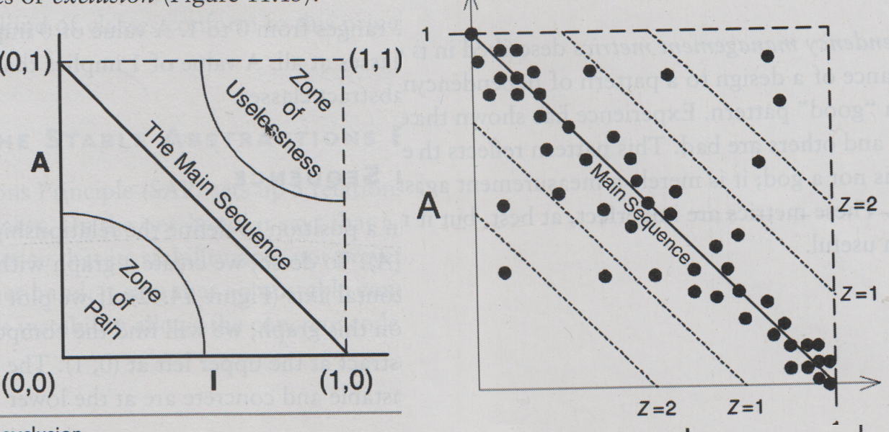

# Book Summary: 

# Clean Architecture
## Robert C. Martin

## Introduction: 

This was the first of the two "Uncle Bob" Software Development (SD) books I read. The book is sparse in its details, when it describes module+design level development paradigms (Design and Component Principles). 

Interestingly, Martin recommends one of his earlier books to fill in the technical details (Agile Software Development (2003)). This fills in a lot of the holes with code examples, and detailed explanations. If some chapters are sparse, references to his earlier book will be made.

## Part I: Introduction:

### Chapter 1 + 2:

- "Architecture" often refers to high-level design details of software, whereas "Design" refers to lower-level details. R.M claims there is no difference.
- "The goal of software architecture is to minimize the human resources required to build and maintain the required system"

- When programmer productivity declines, as the code-base grows, this is a sign of poor software design and code cleaning practices. 

- Real moral of the Tortoise/Hare Story: Find humble hares.

- Test-Driven Development is faster in a repetative coding task, by a significant margin.

- Every organization must avoid over-confidence, and write clean clode+design quality software architecture continuously. That's the message.

- Eisenhower's Matrix: Two axes: Important and Urgent.

- Programmers deal with trade-offs between Architecture and Behaviour of code. The latter implements the requirements for stakeholders, the former deals with code shape and how easily it can be maintined/changed.

- Architecture concerns are always important, but not always urgent.

- Behaviour concerns are always urgent, but not always important. Management will always think they are important, however.

- Software developers are hired to decide what is important with code Architecture - MBAs/Management are not. The pain of development involves contradicting upper-management regarding Behaviour v.s Architecture - even if the threat of a pink slip or quarterly results are looming.

- If the project turns into a ball of mud due to years of prioritizing Behaviour over Architecture - the **development team is to blame**, not sales/management. 

## Part II: Programming Paradigms:

For this section, it gives brief overviews of the three major programming paradigms that exist. I don't want to get caught in programmer tribalism ("OOP is 10x faster", "Lisp is God's Language", etc), nor collect some memorizable facts. I'll summarize the key points of Chapter's 3-6, below.

- All programming paradigms improve code and development by *imposing restrictions* on what developers can do.

1) Strucured Programming: discipline on direct-transfer of control (read: no GOTO).

2) Object-Oriented Programming: discipline on indirect-transfer of control (read: functional pointers or Polymorphic calls).

3) Functional Programming: discipline on assignment, and mutation of state.

### Structured Programming:

- All programs can basically be written with control flow statements (IF/CASE), loops and variables. 
- GOTO was removed because it made programs hard to debug and prove correct.
- It is much easier to prove a large program incorrect (Falsify) than correct. This is why copious testing is pushed.
- Main idea: modularize a program into falsifiable units using basic constructs, so we can more easily build and know wtf is going on.

### Object-Oriented Programming:

- Objects encapsulate data and bundle functions for operating on the said data. This was done previously by non-OO languages (such as C with its "structs", but with less cohesion).

- There are two novel discoveries that OOP has brought us:

1) **Polymorphism:** Or, the usage of functional pointers to augment the behaviour of a block of code. Specifically, in OOP, we don't have access to pointers. We instead have subclasses and super-classes, that can be substitutable.

2) **Dependency Inversion:** Traditionally, source code dependency follows flow of control, and imports. So if a low level import changes, the entire subtree must be re-compiled. With the usage Interfaces to do dependency inversion, this sub-tree recompilation is eliminated. We have modularized, plug-in like sections of code that can be independently deployed.

### Functional Programming:

All race conditions, deadlocks and concurrent update problems are due to improper mutation of state. We choose Functional Programming to mitigate such problems.

We segment an application into immutable and mutable compoenents - with transactional memory (safeguarded). 

Event Sourcing with Checkpoints: We store the original state, and a chain of transactions. We can just compute final or intermediate results, and store checkpoints if the chain of computation is long.

## Part III: Design Principles:

These are low to mid-level principles for designing and combining our code. These refer to SOLID principles. As the descriptions are sparse in this book, I will detail these in the Agile Software Development book summary.

## Part IV: Component Principles:

## Components:

**Murphy's Law of Program Size:** Programs will grow to fill all available compile and link time.

Interestingly, link-time issues persisted with larger programming sizes until the 1980s. This was overcome by *hardware* advances (faster CPU and larger RAM), *not* increasingly clever algorithms or hacks. We can thank Intel for this.

## Component Cohesion:

Much like SOLID principles, there are three principles for building components:

1) **REP: The Reuse/Release Equivalence Principle:**
    - Software cannot be reused unless it is tracked through a release process, and given release numbers. Developers need to specify which release of each dependency they are using.
2) **CCP: The Common Closure Principle:**
    - An extension of the Single Responsibility Prinicple - classes that change for the same reason, or have the same set of responsibilites should be grouped together!
3) **CRP: The Common Reuse Principle:**
    - Don't force users of a component to depend on things they don't need.
    - Classes that are typically used together should be kept in the same component. 
    - When we depend on a component, we also want to depend on all of the classes, not just a subset of them. This leads to unnecessary dependencies.

### Component Cohesion: Tension Triangle: 

Consider a triangle with three verticies, each filled with one of our three principles.

- REP and CCP are inclusive principles, CRP is an exclusive prinicple.

- **Triangle Edge Fallacies:**
    - CCP + CRP only: Hard to reuse (no versioning to rely on).
    - CCP and REP only: too many releases (waste of time).
    - REP and CRP only: too many components change (mess).

## Component Coupling:

There are three principles that deal with the relationship between components:

1) **Acyclic Dependencies Principle:** Acyclic Dependencies should be avoided.
    - By doing this, a cycle acts as one large component dependency. Everything that imports one of the sub-components in the cycle, becomes dependent on the entire cycle.
    - Consider a cycle $A_{1} \rightarrow A_{2} \rightarrow ... \rightarrow A_{n} \rightarrow A_{1}$. Let B,C,D... import any single $A_{i}$ sub-components. Now that a cycle of Ai's is present, any change to an Ai necessitates a recompilation of the other Ai's. Furthermore, each of B,C,D... must also be recompiled.
    - Cycles can be avoided by using The Dependency Inversion trick - create an Interface dependence, and use a factory + typed object pointer to concretize it.
    - Note: One should not remove cycles all the time - just most of the time. "Jitters" and too many interfaces occur, if this is applied in a wanton fashion.

2) **Stable Dependencies Prinicple:**  
    - No component can be truely stable - as volatility is necessary to maintain and update designs.
    - Hard to change components should not depend on volatile ones.
    - A stable component is practically, one that is hard to change - due to a high number of depenencies hung on it.
    - Measure of stability: Fan In/Out on the dependencies graph. If a module has no dependencies, it is *independent* ($\perp$), if it has modules dependent on it, we say it is *responsible*. An ideal unstable module is one that has many depedencies, but it not responsible to anything else.
    - When we design an architecture, we ideally want unstable components to be at the top of the Dependencies graph (Fan-In = 0).
    - In general, **if we make A dependent on B, B must be more stable than A**.

3) Stable Abstractions Principle: 
    - When designing an applicaiton, we wish high-level policy modules to be stable. But they must also be flexible enough to change. How is this done?
    - Using OCP (Open-Closed Principle) - and using abstraction, so we can subclass extensions, but keep the original code base stable.
    - SAP is a relationship between Stability and Abstractness.
    - We can measure Abstractness. Divide the number of (abstract classes+interfaces) by total classes that are depended on.
        - Corner Case: Stand-alone modules with no dependencies should not exist! 
    - SAP adherence for components can be graphed with a chart:

    

    - *Zone of Pain:* Components that are very concrete and stable. This makes them very hard to change. OCP and stability is broken.

    - *Zone of Uselessness:* An area where components are very volatile, but also very abstract. For something abstract to be volatile - this causes code changes for all components that use such an interface (useless...) 

    - What we want are very abstract and stable components, or volatile and concrete components, and everything in-between depending on the state of the development front, and structure of the architecture.

**Other Implications:**

- SAP and SDP: If dependencies run in the direction of stability, and stable components should be abstract, $\rightarrow$ increasing abstraction runs in the direction of dependency.

## Part V: Architecture

Will write some good code+applications before I attempt this section.

