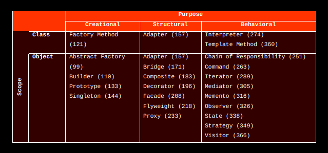

## Notes on Design Patterns: Elements of Reusable OO Software:

### Basic OOP Glossary:

-**Interface:**: A collection of method signatures (name, parameters, return value), that define how we interact
with a given object of a class.
- **Concrete Class:** A non-abstract, regular class.
-**Class**: A block of code that defines an object's interface and implementation of the given interface methods.
-**Abstract Class:** A special class that includes the interface only. It's implementation is handled by sub-classes.
- **Inheritance:** The creation of a class (child or sub-class), from another parent class. In addition to inheriting the interface, and implemented methods (if parent is concrete)
- ** Object:** Run-time entity that packages data, as well as structured methods that act on the data.
- ** Instance (of a class):** An object created by the constructor of the class. Specific data is stored in the data object, and all implemented methods from the class can be applied to the object itself.
- **Constructor:** A special class method that creates new objects on calling.
- **Coupling:** When two classes are dependent on each other in some way.
- **Polymorphism:** The ability to substitute objects of matching interface, for one another at run-time. Polymorphism is used to reduce code footprint and increase code re-usability, generally.
- **Sub-Class:** A child class that formally inherits all fields and methods from a parent class.
-

### Purpose:
This project folder serves to document and implement common design patterns
used in Object Oriented Design.

The top-level read-me file will contain general notes and summaries. Each
design pattern will have its own folder with specific notes, and a practical implementation
to illustrate its usage.

### Introduction:

- OO Design is known to be easy to learn, but hard to master and do correctly.
- The difficulty in finding a good OO Design can be illstrated by the following
statement:

*"You must find pertinent objects, factor htem into classes at teh
right granularity, define class interfaces and inheritence hiearchies, and establish key
relationships among them. Your design should be specific enough to the problem at hand but also
general enough to address future problems and requirements. You want to minimize redesign if possible."*

Effectively, for a software problem using OOP, our solution has many design decisions, as well as parameters
one can attune - this leads to a complex decision problem that needs to be learned from experience.

- One way OOP experts out-perform novices - is that they tailor solutions using well established *Design Patterns*.

- **Def: (General) Design Pattern:** A solution to a common OOP problem, that comes up time and again, but is never implemented
the same way twice.

- **Def: Software Design Pattern:** Descriptions of communicating classes and objects that are customized to solve a general design
problem, in a given context.

- Design Patterns have Four Essential Elements:
1) Pattern Name: A descriptive and apt name that allows us to talk about the problem, and intuitively makes sense.
2) Problem: When to apply the problems
3) Solution: Elements that make up the design. This is a template, whose implementation is context dependent.
4) Consequences: Describes trade-offs for using the particular solution.

### Catalogue Organization:

The design patterns in the book are visually organized in the chart below:

- Purpose: The first (horiz) level of organization separates our patterns in to three broad catagories:

1) **Creational:** Concerned with the process of object creation.

2) **Structural:** Concerned with the composition of classes and objects

3) **Behavioural:** Concerned with the the way objects and classes interact, share repsponsibility.

- Scope: (Vertical) axis, can be one of two levels:

1) **Class**: Deals with relationships between classes and subclasses. These are created via inheritence - and are defined at
compile time

2) **Object**: Deals with relationships between instantiated objects themselves - defined at Run-Time. Most patterns (as seen
above, actually live in this scope).

- Creational Class Patterns defer some object creation to subclasses
- Creational Object Patterns defer object creation to other (non-hiearchial) objects.

- Structural Class Patterns use inheritence to compose classes.
- Structural Object Patterns describe ways of assembling objects together.

- Behavioural Class Patterns use inheritence to describe algorithms and flows of control.
- Behavioural Object Patterns describe how groups of objects coordinate to accomplish a complex task, that no one
object can perform (unless one wants to create a Behemoth Object/Code Blob).
